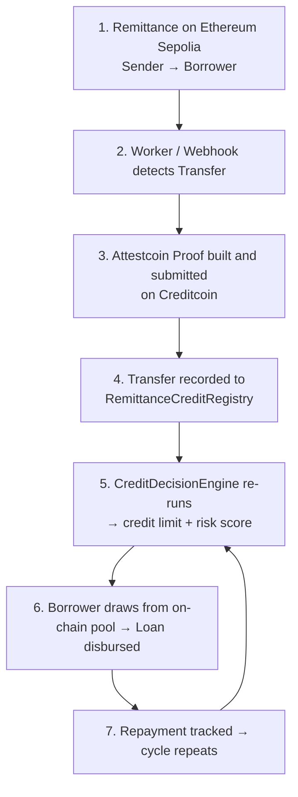
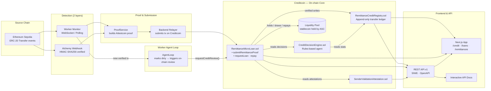

<h1 align="center">
  RemitCredit
</h1>

### Turn verified remittance history into access to credit.

**RemitCredit** is on-chain micro-lending infrastructure that converts **consistently-sent, cryptographically verified remittances** into an autonomous credit line — no traditional credit score, no collateral, no human underwriter.

A borrower's recurring remittance activity is monitored on **Ethereum Sepolia**, proven against **Creditcoin's Attestcoin Protocol** (synchronous block proofs), and fed into a deterministic rules-based credit agent that sizes a loan automatically. Approved borrowers draw from a funded on-chain liquidity pool. Repayment is tracked, and the cycle feeds forward: behavior becomes reputation.

Built for the **Creditcoin hackathon** — but the plumbing underneath is production-grade.

---
<br />
<br />
<h2 align="center" >
 🎥 Product Demo
</h2>


> Watch the 3-minute walkthrough: **remittance → verify → approve → fund → repay** — the whole loop on real testnets.


<br />
<br />
<h3>Short clip: Attestcoin verification in real time</h3>
<br />
<br />


---

## 📸 Product Screenshots

<div style="display: grid; grid-template-columns: repeat(auto-fit, minmax(280px, 1fr)); gap: 16px; margin: 24px 0;">

<div>
<figure>
  
  <p align="center"><em>Onboarding: add or remove senders. Senders are wallets that send to you.</em></p>
</figure>
  <br />
</div>

<div>
<figure>
  
  <p align="center"><em>Verified remittances feed — every row is proven on-chain via Attestcoin.</em></p>
</figure>
  <br />
</div>

<div>
<figure>
  
  <p align="center"><em>Credit decision breakdown: transfer count, total inflow, and interval consistency — all auditable.</em></p>
</figure>
  <br />
</div>

</div>

---

## 💡 The Problem

2.2 billion unbanked and underbanked adults send **$700+ billion a year in remittances** across borders. These are among the most financially consistent people on Earth - yet most have:

- ❌ No traditional credit score
- ❌ No banking relationship history
- ❌ No collateral to pledge
- ❌ No formal proof of income

What they *do* have is an on-chain trail: **month after month, the same sender sends the same money to the same recipient.**

Traditional lending looks past this signal. RemitCredit is built *on top of it*.

> **Don't start creditworthiness from zero when someone's financial behavior already exists on-chain.**

---

## ✨ How It Works — End to End

The loop has **six discrete stages**, each automated end-to-end.



### 1. A remittance is sent on Ethereum Sepolia

The borrower has pre-registered one or more **declared senders** (e.g. a family member abroad). Every time that sender's ERC-20 wallet sends USDC to the borrower on Sepolia, it's a candidate remittance.

### 2. Automatic detection — zero input from the borrower

Two redundant detection layers run in parallel:

- **WebSocket monitor (`worker/src/monitor.ts`)** — subscribes to `Transfer` events on the remittance token contract over a persistent WSS connection. Falls back to HTTP polling if WSS isn't available. Near-instant when using an archive node's push socket.
- **Alchemy Custom Webhook (`src/server/alchemyWebhook.ts`)** — signed with HMAC-SHA256 (signature-verified, never trusts an unsigned webhook), parses ERC-20 `Transfer` log topics directly from the GraphQL payload.

**No manual uploads. No self-reporting. No "paste your transaction hash." The payment is the evidence.**

### 3. Attestcoin Protocol — the verification layer

This is the heart of RemitCredit. The detected transaction isn't just "referenced" — it's **cryptographically proven to have been included in the source chain block**.

The worker (`worker/src/submitProof.ts`) builds the proof payload:
```
Raw transaction bytes
  + Merkle inclusion proof (tx → Sepolia block)
  + Continuity proof (Attestcoin block attestation)
```

These are submitted synchronously to the **Attestcoin Block Prover precompile** on Creditcoin inside `submitRemittanceProof()`. The precompile returns `false` unless **every byte matches**.

> [!IMPORTANT]
> The on-chain contract also enforces that `sourceTxHash == keccak256(encodedTx)` before calling the precompile. A caller can't associate an arbitrary hash with a proof — the bytes and the claimed hash are locked together.

### 4. Verified transfers land in an append-only registry

Once Attestcoin says "verified," `RemittanceCreditRegistry.sol` records the transfer in an append-only, timestamp-ordered list. Duplicates are prevented by a `bytes32` hash set. This registry is the **single source of truth** — every downstream component reads from it.

### 5. Credit decision — a deterministic, auditable agent

`CreditDecisionEngine.sol` runs *entirely on verified data*. There are four hurdles:

| Check | Rule (default params) | Purpose |
|-------|----------------------|---------|
| **Transfer count** | ≥ 3 verified remittances | One lucky transfer doesn't earn a line |
| **Total inflow** | ≥ $300 verified in-window | Establishes real activity |
| **Interval consistency** | ≥ 50% regularity score | "Every 2 weeks" vs "at random" matters |
| **Recency** | Last transfer ≤ 60 days old | Stale history loses eligibility |

The consistency score is computed on-chain from each transfer's absolute deviation from the mean interval, in basis points. Transfers in the same second are treated as perfect (100%) to avoid divide-by-zero.

If all four pass:

```
creditLimit  = min(totalInflow × creditMultiplier, hardCap)
            = min(totalInflow × 0.30, $1,000)

riskScore   = (intervalConsistency + countConfidence) / 2
```

The engine also emits a human-readable **rationale string** with every decision. The same decision function is mirrored in TypeScript (`shared/services/creditAgent.ts`) so the frontend can preview eligibility *for free* before spending gas on an on-chain review.

> [!TIP]
> The agent is deliberately *not* a black-box ML model. Every input, every parameter, every decision is inspectable on-chain. A lending decision the borrower can't audit is a worse decision.

### 6. Loan from the liquidity pool. Repay. Repeat.

The `RemittanceMicroLoan` ASC holds a pool of stablecoin. Any registered wallet can seed the pool (`fundPool`).

When an eligible borrower requests:
1.  Pool liquidity is checked
2.  Available credit (limit − outstanding) is checked
3.  Tokens are transferred **directly to the borrower** (the relayer never custodies)

Repayment uses a standard ERC-20 `approve` + `safeTransferFrom` pattern. The borrower signs one approval from their own wallet; the relayer just submits the `repay()` call and pays gas.

Every repayment reduces outstanding principal, which in turn releases more borrowing capacity — and next month's remittances push the credit limit higher.

---

## 🔐 Attestations & Sender Validation

Before a declared sender is accepted into the credit loop, RemitCredit runs a full background check and writes the result **immutably on-chain** via `SenderValidationAttestation.sol`.

### Sender validation pipeline (off-chain compute, on-chain result)

`shared/services/senderValidationPipeline.ts` executes three checks in parallel:

| Check | What it finds | Why |
|-------|---------------|-----|
| **Wallet age & volume** | First tx timestamp, total tx count, total ETH value | Brand-new wallet with 2 outbound txs? High risk |
| **Funding source trace** | Walks inbound transfers. Hard-rejects if `recipient_funded` (borrower funded the "sender") | Prevents circular self-onboarding |
| **Sanctions screening** | Checks against OFAC SDN contract (`isSanctioned(address)`) | Compliance floor |

The result — verification status, wallet age, funding source classification, hashed risk flags — is published to `SenderValidationAttestation.attest()` and keyed by `(sender, recipient)`. Both read *and* write are public, so **no backend can silently change its mind later** without leaving a trail.

---

## 🌐 Business API — Plug RemitCredit Into Your Product

RemitCredit ships a full **OpenAPI 3.1.0** spec under `/api/v1/openapi` with interactive documentation at `/docs/api`. All calls are authenticated with **SIWE (Sign-In with Ethereum)** wallet sessions.

> [!NOTE]
> **KYB + KYC integrations are planned immediately post-hackathon** and will plug into the auth / sender-validation layers above. The core financial primitives intentionally don't depend on the identity provider, so you can swap compliance providers without touching the credit logic.

### What the API exposes

```text
Auth
  POST /api/v1/auth/challenge         → Request SIWE nonce
  POST /api/v1/auth/verify            → Sign + get session token
  POST /api/v1/auth/session           → Validate / refresh

Credit
  GET  /api/v1/credit/profile         → Eligibility, limit, risk, rationale
  GET  /api/v1/credit/available       → Drawable amount (limit − outstanding)
  GET  /api/v1/credit/limit           → Current credit limit
  GET  /api/v1/credit/risk-score      → Blended risk score bps
  GET  /api/v1/credit/rationale       → Human-readable explanation
  POST /api/v1/credit/review          → Trigger on-chain re-decision

Loans
  POST /api/v1/loans/request          → Draw from available credit
  POST /api/v1/loans/repay            → Repay principal
  GET  /api/v1/loans                  → Current loan state & balance

Transfers / Remittances
  GET  /api/v1/transfers              → Verified remittance history
  POST /api/v1/transfers/verify       → Manually trigger verify by tx hash
  GET  /api/v1/transfers/stats        → Count · total · avg interval · consistency

Senders
  GET  /api/v1/senders                → Declared + validated sender list
  POST /api/v1/senders                → Register a new declared sender
  GET  /api/v1/senders/:addr          → Validation attestation for one sender

Activity
  GET  /api/v1/activity               → Unified audit feed (verifications · loans · repayments)
```

**The API is stateless.** Authoritative state is always the on-chain contracts. Sessions, idempotency keys, and the activity index live in Redis. No application database, no dual-write problem.

> [!EXAMPLE]
> A remittance company could show the borrower's available credit limit *inside their own send-money flow* by calling just `GET /credit/profile` and `POST /loans/request` — without rebuilding any of the proof, registry, or credit engine.

---

## 🏗️ System Architecture



### Smart Contract Map

| Contract | Network (Hackathon) | Job |
|----------|---------------------|-----|
| `RemittanceMicroLoan.sol` | Creditcoin CC3 Testnet | Central ASC. Proof verify + pool custody + borrow/repay |
| `RemittanceCreditRegistry.sol` | Creditcoin CC3 Testnet | Append-only verified-transfer ledger + stats engine |
| `CreditDecisionEngine.sol` | Creditcoin CC3 Testnet | Deterministic 4-rule credit agent |
| `SenderValidationAttestation.sol` | Creditcoin CC3 Testnet | On-chain audit log for sender KYC results |
| `VerifyRelay.sol` | Creditcoin CC3 Testnet | Helper relay contract for batch proof verification |
| MockStablecoin | Ethereum Sepolia | Remittance token (USDC stand-in) |
| MockAttestcoinBlockProver | Creditcoin CC3 Testnet | Dev-mode prover mirroring the real precompile API |

### Monorepo Layout

```text
remitcredit/
├── contracts/                  Solidity smart contracts
│   ├── interfaces/             IAttestcoinBlockProver · IRemittanceCreditRegistry
│   └── mocks/                  Testnet mocks
├── shared/                     Code run by BOTH frontend and worker
│   ├── services/
│   │   ├── creditAgent.ts      TypeScript mirror of CreditDecisionEngine (gas-free previews)
│   │   ├── contractClient.ts   Unified ethers client for all on-chain reads/writes
│   │   ├── proofService.ts     Attestcoin proof builder (USC SDK)
│   │   ├── proofEncoding.ts    ABI encoder for merkle/continuity proofs
│   │   ├── senderValidationPipeline.ts  3-part sender checks + on-chain attest
│   │   ├── txDecoder.ts        ERC-20 tx decode → sender/recipient/amount/timestamp
│   │   └── wsProvider.ts       Resilient reconnecting WebSocket
│   ├── types.ts · abi.ts       Shared types + ABIs
│   └── config.ts               Cross-package configuration
├── worker/                     Oracle worker — runs 24/7
│   └── src/
│       ├── monitor.ts          Detects remittances via WS / HTTP polling
│       ├── submitProof.ts      Deploy→Prove→Verify pipeline per transaction
│       └── runAgentLoop.ts     Re-triggers credit review when new data lands
├── src/                        Next.js 14 frontend + API routes (App Router)
│   ├── app/
│   │   ├── credit/             Credit decision dashboard + progress gauge
│   │   ├── loans/              Loan request + repayment UI
│   │   ├── remittances/        Verified transfer feed + stats cards
│   │   ├── dashboard/          Admin / borrower overview
│   │   ├── docs/api/           Interactive Scalar OpenAPI playground
│   │   └── api/
│   │       ├── v1/             Full REST API (16 endpoints) + OpenAPI spec
│   │       ├── credit/*        Preview · review · fetch
│   │       ├── loans/*         Request · repay · status
│   │       ├── remittances/*   Verify · stats · list
│   │       ├── senders/*       Declare · validate · fetch
│   │       └── alchemy/        Signed Alchemy webhook ingestion
│   ├── server/                 Route handlers · Redis store · alchemyWebhook sig verify
│   ├── components/             AppShell · Cards · Tooltip · Badge · ApiPlayground
│   └── lib/                    api client · wallet (wagmi/Rainbow) · utils
├── scripts/                    deploy.ts · fundPool.ts · fundUser.ts
├── test/                       Hardhat test suite (16+ cases)
├── public/                     Screenshots + demo videos
└── sanctions.json              Chainalysis OFAC SDN contract address
```

---

## ⚙️ Automatic Remittance Verification — The Deep Dive

This is the part judges most frequently ask about: **how do you actually prove the remittance happened, end to end?**

Here's the chain of custody for **one** ERC-20 USDC transfer from `0xA` (sender) → `0xB` (borrower):

```
Step 1 — Detection
  monitor.ts is listening via wss://eth-sepolia.g.alchemy.com/v2/KEY
  ERC-20 Transfer event fires (topics: Transfer signature, padded sender, padded recipient)
  monitor extracts: txHash = 0x9f1c…
  Checks: is 0xA a declared sender of 0xB? (in-memory map hydrated from chain events)
  YES → calls submitRemittanceProofForTx(config, client, "0xB", "0x9f1c…")

Step 2 — Fetch raw tx
  srcProvider.getTransaction("0x9f1c…") returns the RLP-serialized tx bytes.
  Decoded: sender=0xA, to=USDC_Contract, data=transfer(0xB, 300_000_000) (=$300)

Step 3 — Wait for Attestcoin block attestation
  ProofService polls USC SDK until the block is attested on Creditcoin.
  Builds:
    · txBytes           RLP-encoded signed transaction
    · merkleProof       siblings + index proving txBytes ∈ block
    · continuityProof   Attestcoin block header + attestation chain

Step 4 — Submit on Creditcoin
  loan.submitRemittanceProof(
    borrower=0xB, chainKey=SEPOLIA, blockHeight=5_812_340,
    txBytes, merkleProof (ABI-encoded), continuityProof (ABI-encoded),
    claimedSender=0xA, claimedAmount=300e6, claimedTimestamp=1_743_500_000,
    sourceTxHash=keccak256(txBytes)
  )

Step 5 — On-chain contract enforces the checks (revert on any fail)
  ✓ sourceTxHash == keccak256(encodedTx)?                       Revert: TxHashMismatch
  ✓ 0xA is declared for 0xB?                                     Revert: SenderNotDeclared
  ✓ precompile.verifyAndEmit(chainKey, blockHeight, txBytes, …)  Revert: ProofNotVerified
  → registry.recordVerifiedTransfer()
  → emit RemittanceVerified(0xB, 0xA, 300e6, timestamp, txHash)

Step 6 — Credit agent notices
  monitor calls agentLoop.markDirty("0xB")
  Next tick → requestCreditReview("0xB")
  Engine reads registry stats → new limit → emit CreditReviewed

From Sepolia block confirmation → Creditcoin credit limit updated: ~1–2 minutes.
```

> [!NOTE]
> There's also a **batch proof** variant. A borrower onboarding with 6 months of history can be verified in *one* on-chain call sharing a single continuity proof, rather than 6+ individual calls. This is the depth-of-utilization path and is fully implemented in `submitRemittanceProofBatch()`.

---

## 🔍 Why Attestcoin Matters (The Trust Boundary)

A naive version of this idea would be: "an oracle worker says sender sent money to borrower, trust it." That's a single point of failure.

RemitCredit's trust boundary is **different**:

| Component | What it can / cannot do |
|-----------|-------------------------|
| **Worker** | Detects txs, fetches proofs, submits them. It *cannot* forge a transfer — the precompile will reject proof of a tx that never existed |
| **Backend relayer** | Pays gas and submits borrower-scoped writes. It *cannot* disburse to itself — `requestLoan` always transfers to the borrower param. It never custodies funds |
| **Attestcoin precompile** | The actual verification gate. Nothing gets recorded unless this returns `true`. This is the protocol-level promise |
| **Registry** | Writes only from RemittanceMicroLoan. Once written, transfer history is append-only and indexed by hash |
| **Credit engine** | Deterministic pure function. Same inputs → same decision, every time, on-chain or off-chain |

Said another way: **a compromised worker can at worst *fail to notice* a transfer. It can never invent one.**

---

## 🧪 Testing & Reliability

- **16+ Hardhat cases** covering registry stats (single transfer, perfect consistency, irregular intervals, same-second divide-by-zero, zero transfers), credit decision engine (all four rejection paths + accept + count-confidence saturation), and the full ASC lifecycle (register → proof submit → review → borrow → repay → borrow-again capped).
- **Idempotent submissions:** Duplicate proof submissions revert with `DuplicateTransfer` — the worker catches this as `AlreadyRecordedError` and no-ops, so double-triggered webhooks are harmless.
- **Crash recovery:** The AgentLoop persists dirty-borrower markers to Redis. A worker that dies mid-run recovers its queue on next start instead of dropping reviews.
- **Resilient WebSocket:** The WS provider auto-reconnects with exponential backoff and rebuilds all event listeners on each new socket. Dropped connections don't mean missed transfers.

---

## 🚀 Getting Started

### Prerequisites

- **Node.js 20+**
- **pnpm** (`npm install -g pnpm`)
- **Creditcoin CC3 Testnet** RPC + funded relayer wallet
- **Ethereum Sepolia** RPC (HTTP + optional WSS for instant detection)
- **Alchemy** app + Custom Webhook (for the webhook detection layer — optional; worker monitor works standalone)
- **Upstash / local Redis** (for v1 API sessions, idempotency, activity cache)
- **USC SDK** credentials (to build Attestcoin proofs — `@gluwa/usc-sdk` already in package.json)

### Install

```bash
pnpm install
pnpm compile       # Compile Solidity + generate Typechain types
```

### Configure

```bash
cp .env.example .env.local
# Edit: CC3_TESTNET_*, SEPOLIA_*, ALCHEMY_*, REDIS_*, USC_*
```

Key environment variables (see `.env.example` for the full list):
```env
# Creditcoin — where the contracts live
CC3_TESTNET_RPC_URL=https://rpc.cc3-testnet.creditcoin.network
CC3_TESTNET_CHAIN_ID=102031
WORKER_PRIVATE_KEY=0x…             # Relayer wallet — gas on Creditcoin

# Source chain — where remittances are observed
SEPOLIA_RPC_URL=https://eth-sepolia.g.alchemy.com/v2/${ALCHEMY_KEY}
SEPOLIA_WSS_RPC_URL=wss://eth-sepolia.g.alchemy.com/v2/${ALCHEMY_KEY}
REMITTANCE_TOKEN_ADDRESS=0x…       # Mock USDC on Sepolia

# Webhook verification
ALCHEMY_WEBHOOK_SIGNING_KEY=whsec_…

# Proof service (USC SDK)
USC_API_KEY=…
USC_NODE_ID=…
```

### Deploy Contracts + Seed Pool

```bash
# 1. Deploy everything to CC3 testnet
pnpm hardhat run scripts/deploy.ts --network cc3Testnet

# 2. Deploy mock stablecoin to Sepolia (for remittance tests)
pnpm hardhat run scripts/deployMocks.ts --network sepolia

# 3. Seed the lending pool ($10k in 6-decimal stablecoin = 10_000_000_000 units)
pnpm hardhat run scripts/fundPool.ts --network cc3Testnet
```

### Run Locally (3 terminals)

```bash
# Terminal 1 — Oracle worker (detects transfers, builds proofs, submits, triggers reviews)
pnpm worker:dev

# Terminal 2 — Next.js frontend + API
pnpm frontend:dev
# → http://localhost:3000

# Terminal 3 (optional) — Run full smart contract test suite
pnpm test
```

### Explore the API

Open `http://localhost:3000/docs/api` after starting the frontend. It's an interactive Scalar playground:
- Full request / response schemas
- Try every endpoint (wallet-sign a session first)
- Copyable cURL snippets

---

## 🌟 Feature Summary

| Feature | Where it lives | Status |
|---------|---------------|--------|
| **Synchronous Attestcoin proof verification** | `RemittanceMicroLoan.submitRemittanceProof` + precompile | ✅ Hackathon |
| **Dual-layer transfer detection** (WS monitor + signed webhooks) | `worker/src/monitor.ts` · `src/server/alchemyWebhook.ts` | ✅ Hackathon |
| **Append-only verified-transfer registry** | `RemittanceCreditRegistry.sol` | ✅ Hackathon |
| **On-chain consistency + stats engine** | `RemittanceCreditRegistry.getStats()` | ✅ Hackathon |
| **Deterministic 4-rule credit agent** | `CreditDecisionEngine.sol` | ✅ Hackathon |
| **Gas-free decision preview (TypeScript mirror)** | `shared/services/creditAgent.ts` | ✅ Hackathon |
| **On-chain liquidity pool** | `RemittanceMicroLoan.fundPool / requestLoan / repay` | ✅ Hackathon |
| **Sender validation pipeline** (wallet age + funding trace + sanctions) | `shared/services/senderValidationPipeline.ts` | ✅ Hackathon |
| **Immutable attestation of sender KYC results** | `SenderValidationAttestation.sol` | ✅ Hackathon |
| **Batch proof verification** (1 call for N transfers) | `submitRemittanceProofBatch()` | ✅ Hackathon |
| **Autonomous agent loop** (re-decide on new data) | `worker/src/runAgentLoop.ts` | ✅ Hackathon |
| **Business REST API v1 + OpenAPI + playground** | `src/app/api/v1/*` · `/docs/api` | ✅ Hackathon |
| **SIWE wallet session auth** | `src/server/v1/auth.ts` | ✅ Hackathon |
| **Full React UI** (credit, loans, remittances, dashboard, onboarding) | `src/app/**` | ✅ Hackathon |
| **Production KYC** (e.g. Onfido / Veriff) | Plug into sender validation pipeline | 🔜 Post-hackathon |
| **Production KYB** for business API users | Plug into v1 auth middleware | 🔜 Post-hackathon |
| **Dynamic credit parameters via governance** | `CreditDecisionEngine.setParams()` is owner-only today | 🔜 Post-hackathon |
| **LP yield / pool yield model** | Currently zero-yield pool | 🔜 Post-hackathon |
| **Mainnet deployments** | CC3 + real USDC source chains | 🔜 Post-hackathon |

---

## 🎯 Why RemitCredit?

Plenty of projects put loans on-chain. Almost none solve the *actual* hard problem at the bottom of the stack.

The hard problem isn't "how do I transfer an ERC-20 from a pool to a borrower." Ethereum solved that in 2016.

The hard problem is:

> **How do you get a credit signal you can trust, for a population that traditional credit bureaus have never heard of?**

RemitCredit's answer is four layers deep and each one compounds the trust of the last:

1.  **Observe** behavior on a source of financial truth people already use (Sepolia / any EVM where ERC-20 remittances happen).
2.  **Prove** every single transfer with Attestcoin block proofs — not oracles, not signed claims, actual inclusion proofs.
3.  **Decide** with a rules engine that reads *only* proven data, emits a public rationale, and can be previewed for free.
4.  **Recycle** repayment back into the history, so each successful loan + payback is a stepping stone toward a larger line.

The result isn't just another dApp. It's a **credit onramp for the 2.2 billion people the existing system skipped** — built on primitives that are open, auditable, and don't require trusting the backend operator.

> RemitCredit: *Every remittance is a down payment on your credit future.*

---

## 🛠️ Built for the Creditcoin Hackathon

RemitCredit leans into exactly what Creditcoin + Attestcoin make uniquely possible: **cross-chain state proofs without a trusted oracle network.**

The Attestcoin precompile is the linchpin that makes the whole design honest. Without it, we'd be back to "trust the relayer" — which is exactly what every other remittance-lending idea does. With it, we have a system where:

- A judge can verify every single transfer that went into a credit decision
- A borrower can read their own rationale and the exact stats behind it
- An auditor can replay the credit agent *on-chain* or *off-chain* and get the same answer
- The worst a compromised worker can do is ignore transfers (easily noticed) — it can't fabricate one

That's the difference between a demo and infrastructure.

**Enjoy the project.** 🙏
